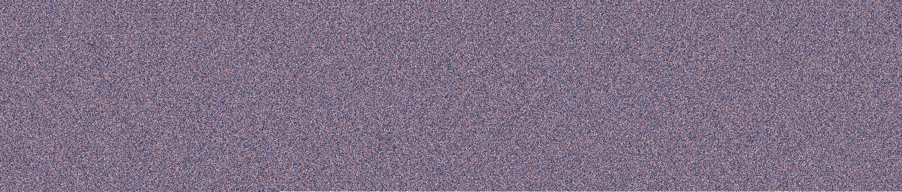

# PaletteRipper
 A Python 3 program I wrote to practice with the Pillow library.

PaletteRipper is a script which analyses an image and outputs a colour palette from it. The quality of the colour palette as well as the number of colours are dependent on the individual parameters given.

## Usage

________

`python3 PaletteRipper.py [MODE] [INPUTFILE] [OUTPUTFILE] [QUALITY/NUMBER] (SORTED)`  

Modes:
--fullset --> Isolates all unique colours and reassembles them in a new image.

--simplified --> Chooses the most common colours and reassembles them in a new image.

Modifiers:

[QUALITY] --> The number of times to divide the picture width and height by. A higher number corresponds to fewer colours. This is used when --fullset is chosen.

Essentially, if you have a larger number, the picture will be shrunk further by that scale factor and the colour generated will be lesser. Use 1 for maximum quality.

SORTED (Y/N) --> Determines whether the full palette should be sorted. Only works for --fullset.

NUMBER --> The maximum number of colours to put in the new image. Note that this may not be possible for large numbers. This is used when --simplified is chosen.

INPUTFILE --> The name of the picture to extract the colour palette from.

OUTPUTFILE --> The name of the picture where the colour palette will be placed. Please save as PNG to avoid compression.

## Examples

___

Original Image: 

Photo by [Denis Degioanni](https://unsplash.com/@denisdegioanni?utm_source=unsplash&utm_medium=referral&utm_content=creditCopyText) on [Unsplash](https://unsplash.com/s/photos/milky-way?utm_source=unsplash&utm_medium=referral&utm_content=creditCopyText)

Full set with highest quality (QUALITY = 1) sorted:

Full set with QUALITY = 5 sorted:

Full set with highest quality (QUALITY = 1) unsorted:

Simplified Set with 15 colours (each colour is one pixel in size):

